{width="0.5236111111111111in"
height="0.5847211286089239in"}

**instructables**

{width="0.5097222222222222in"
height="0.5097211286089239in"}

> by
>
> Say goodbye to hassle with these DIY Solar lamps.

Save energy by installing a DIY solar lamp in your house. These lamps
are easy to install and will provide hours of light whenever you need
it. This is great for when the power goes out or when someone needs some
light after sunset. These lamps also won\'t cost a thing as they are
powered by solar energy!

With these lamps, you can forget about expensive electric bills,
replacement bulbs, and maintenance work that needs to be done on
traditional lighting sources. It\'s safe, reliable, and environmentally
friendly!

> Go green today with this amazing solar lamp.

**Supplies:**

> Get all the components ready.

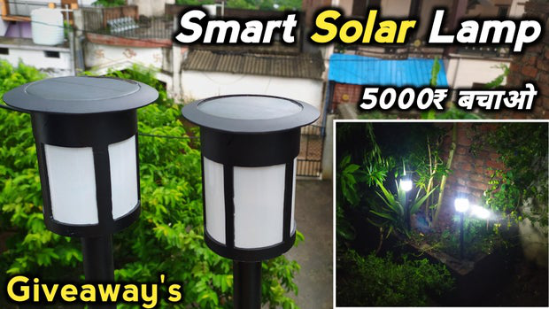{width="7.477777777777778in"
height="4.208333333333333in"}

**Step 1: Get Your PCB Ready!**

DIY Solar Lamp: Page 1

**Talking about electronics.**

{width="0.1388888888888889in"
height="0.1527777777777778in"}

{width="0.1388888888888889in"
height="0.3611111111111111in"}

> After making the circuit diagram I transformed it into a PCB design to
> produce it, to produce the PCB, I have chosen the best PCB supplier
> and the cheapest PCB provider to order my circuit. with thereliable
> platform, all I need to do is some simple steps which we will talk
> later.
>
> Related Download Files\
> **As you can see in the pictures above the PCB is very well
> manufactured and I've got the same PCB assembled with all the
> components that we want to use for our main board and all the labels
> and logos are there to guide me during the soldering steps. You can
> also download the Gerber �le for this circuit from the download link
> below in case you want to place an order for the same circuit
> design.**

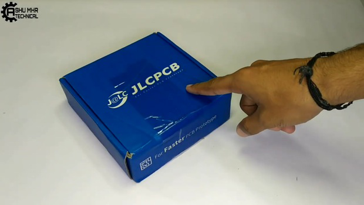{width="7.477777777777778in"
height="4.208333333333333in"}

DIY Solar Lamp: Page 2

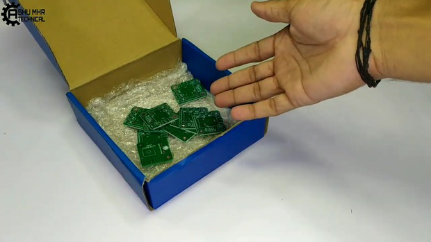{width="7.477777777777778in"
height="4.208333333333333in"}

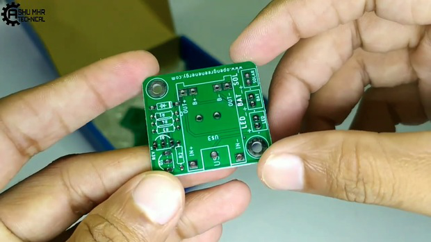{width="7.477777777777778in"
height="4.208333333333333in"}

DIY Solar Lamp: Page 3

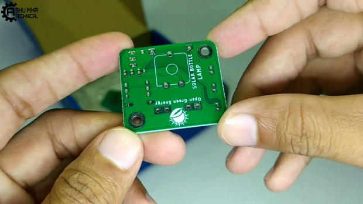{width="7.477777777777778in"
height="4.208333333333333in"}

**Step 2: Place All the Components on PCB and Solder It Properly.**

> Soldering the components to PCB.

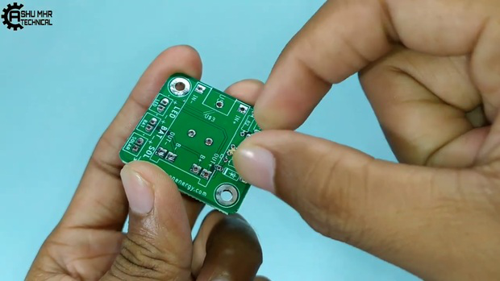{width="7.477777777777778in"
height="4.208332239720035in"}

DIY Solar Lamp: Page 4

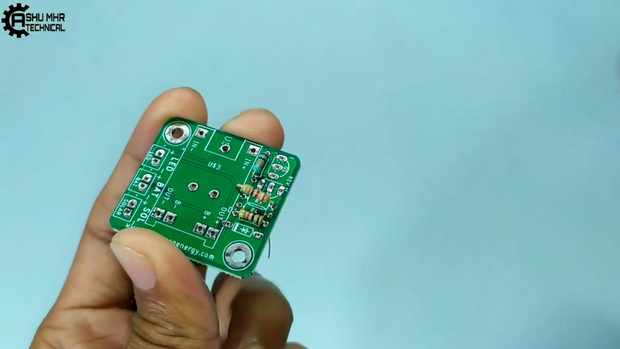{width="7.477777777777778in"
height="4.208333333333333in"}

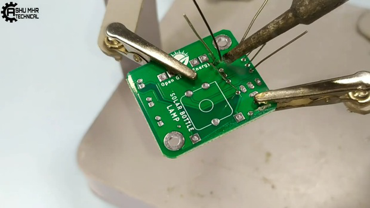{width="7.477777777777778in"
height="4.208333333333333in"}

DIY Solar Lamp: Page 5

{width="7.477777777777778in"
height="4.208333333333333in"}

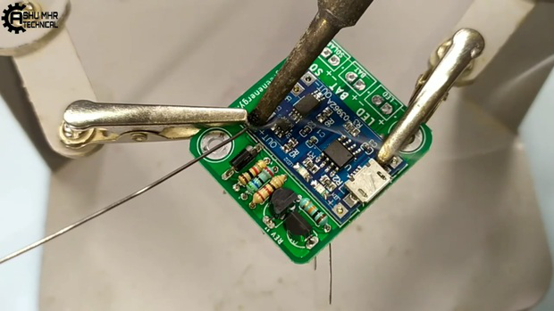{width="7.477777777777778in"
height="4.208333333333333in"}

DIY Solar Lamp: Page 6

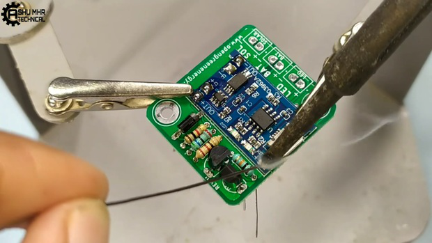{width="7.477777777777778in"
height="4.208333333333333in"}

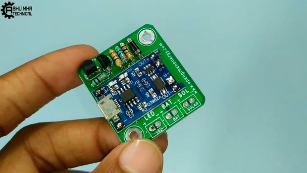{width="7.477777777777778in"
height="4.208333333333333in"}

DIY Solar Lamp: Page 7

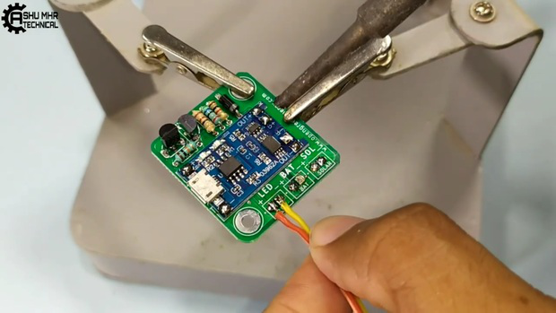{width="7.477777777777778in"
height="4.208333333333333in"}

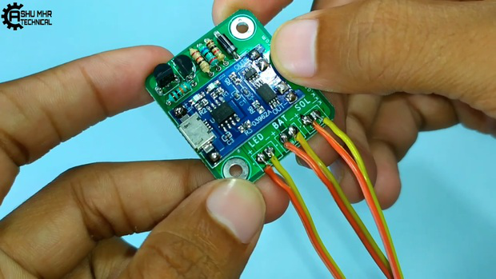{width="7.477777777777778in"
height="4.208333333333333in"}

**Step 3: Making Custom PVC Designed Body.**

> Designing and moulding body.(Dimensions as per your requirement)

DIY Solar Lamp: Page 8

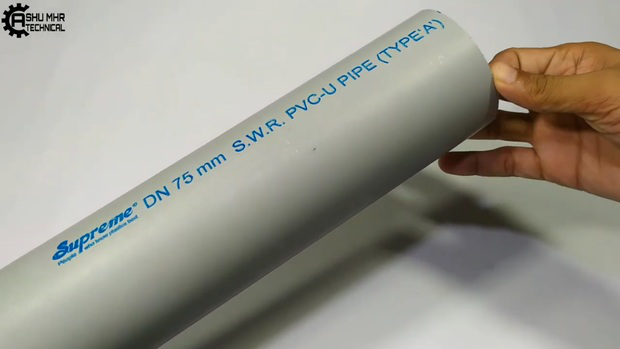{width="7.477777777777778in"
height="4.208333333333333in"}

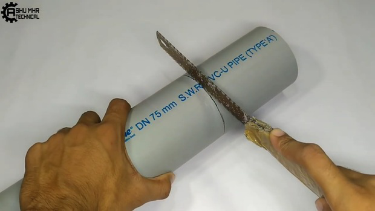{width="7.477777777777778in"
height="4.208333333333333in"}

DIY Solar Lamp: Page 9

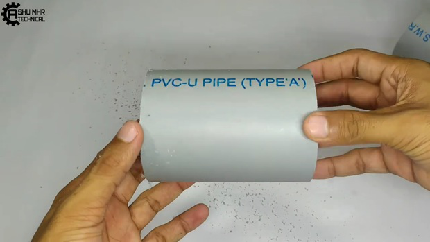{width="7.477777777777778in"
height="4.208333333333333in"}

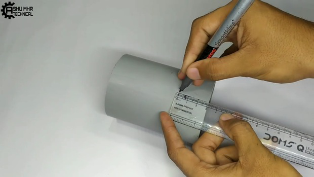{width="7.477777777777778in"
height="4.208333333333333in"}

DIY Solar Lamp: Page 10

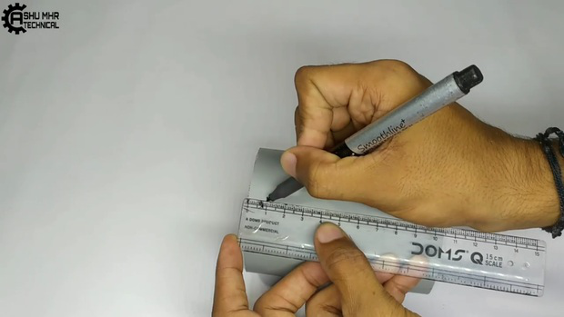{width="7.477777777777778in"
height="4.208333333333333in"}

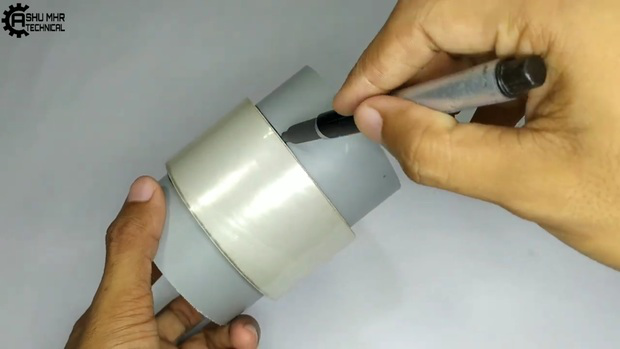{width="7.477777777777778in"
height="4.208333333333333in"}

DIY Solar Lamp: Page 11

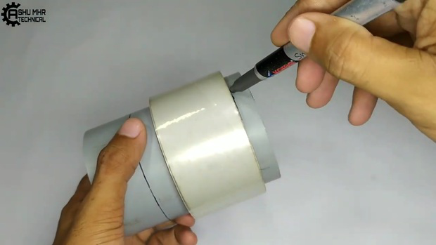{width="7.477777777777778in"
height="4.208333333333333in"}

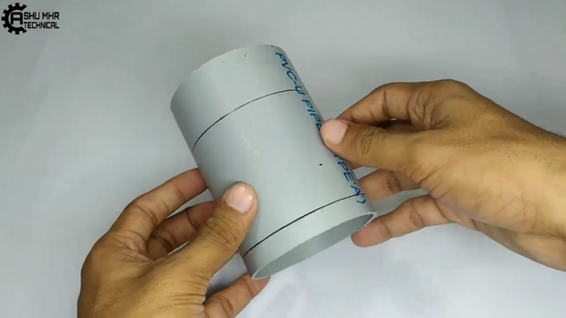{width="7.477777777777778in"
height="4.208333333333333in"}

DIY Solar Lamp: Page 12

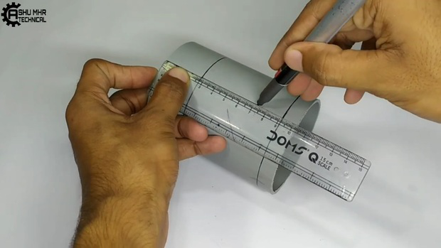{width="7.477777777777778in"
height="4.208333333333333in"}

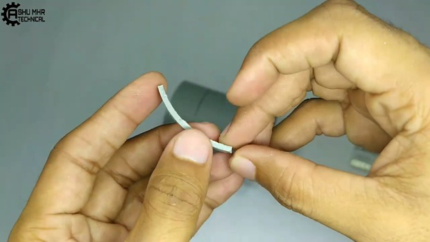{width="7.477777777777778in"
height="4.208333333333333in"}

DIY Solar Lamp: Page 13

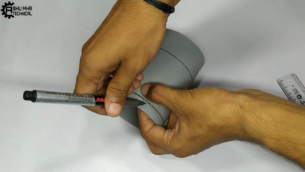{width="7.477777777777778in"
height="4.208333333333333in"}

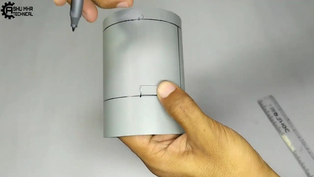{width="7.477777777777778in"
height="4.208333333333333in"}

DIY Solar Lamp: Page 14

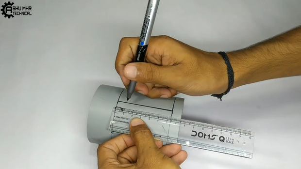{width="7.477777777777778in"
height="4.208333333333333in"}

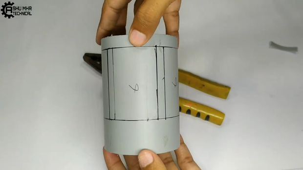{width="7.477777777777778in"
height="4.208333333333333in"}

DIY Solar Lamp: Page 15

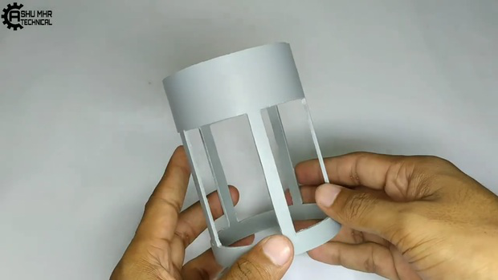{width="7.477777777777778in"
height="4.208333333333333in"}

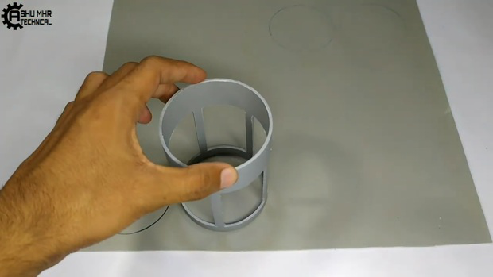{width="7.477777777777778in"
height="4.208333333333333in"}

DIY Solar Lamp: Page 16

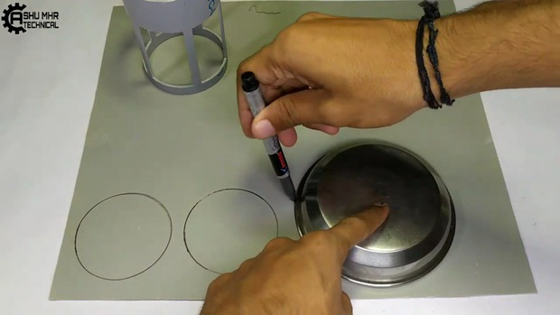{width="7.477777777777778in"
height="4.208333333333333in"}

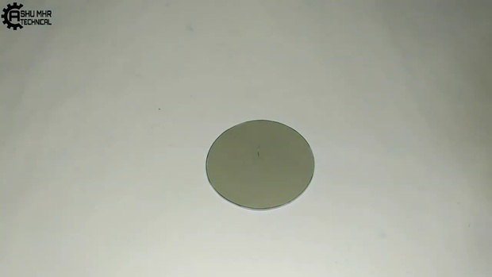{width="7.477777777777778in"
height="4.208333333333333in"}

DIY Solar Lamp: Page 17

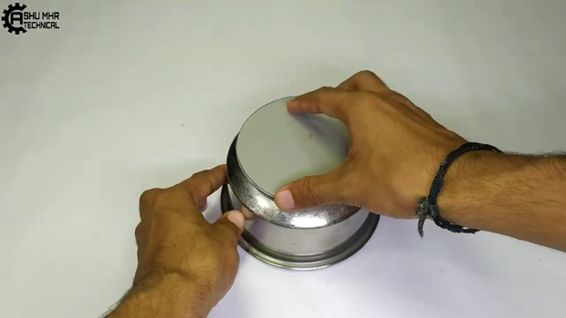{width="7.477777777777778in"
height="4.208333333333333in"}

{width="7.477777777777778in"
height="4.208333333333333in"}

DIY Solar Lamp: Page 18

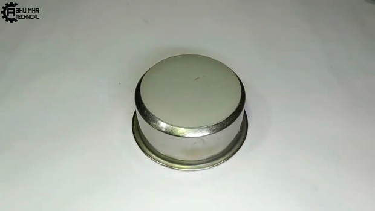{width="7.477777777777778in"
height="4.208333333333333in"}

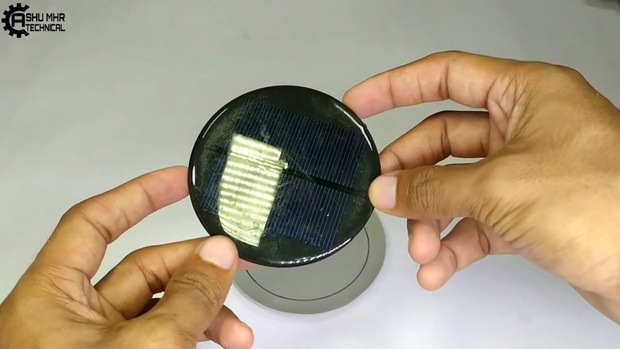{width="7.477777777777778in"
height="4.208333333333333in"}

DIY Solar Lamp: Page 19

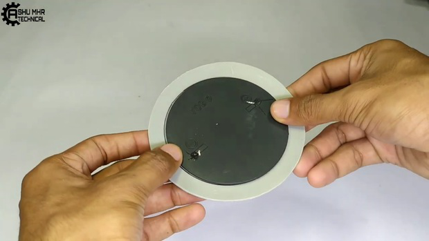{width="7.477777777777778in"
height="4.208333333333333in"}

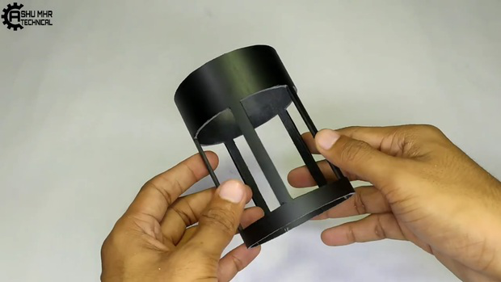{width="7.477777777777778in"
height="4.208333333333333in"}

**Step 4: Sticking Diffuser Sheet and Led Strip**

> Sticking Di�user Sheet to the Custom Designed PVC body And Led Strip
> to Base Plate.

DIY Solar Lamp: Page 20

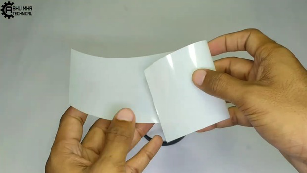{width="7.477777777777778in"
height="4.208333333333333in"}

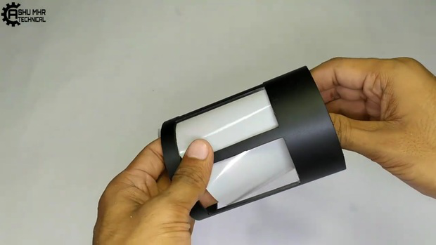{width="7.477777777777778in"
height="4.208333333333333in"}

DIY Solar Lamp: Page 21

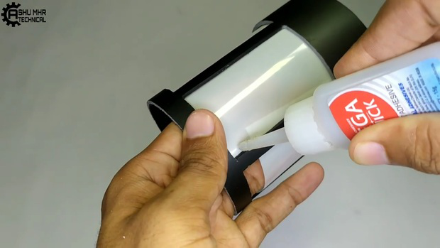{width="7.477777777777778in"
height="4.208333333333333in"}

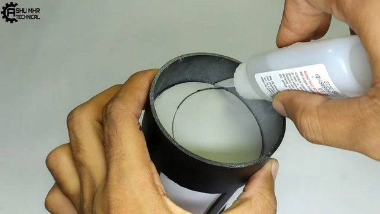{width="7.477777777777778in"
height="4.208333333333333in"}

DIY Solar Lamp: Page 22

{width="7.477777777777778in"
height="4.208333333333333in"}

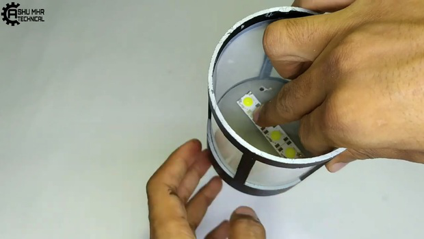{width="7.477777777777778in"
height="4.208333333333333in"}

DIY Solar Lamp: Page 23

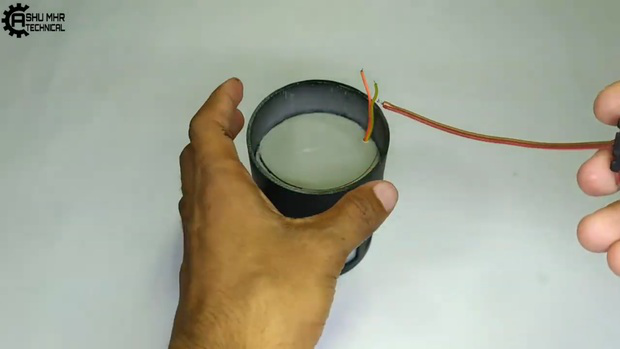{width="7.477777777777778in"
height="4.208333333333333in"}

**Step 5: Soldering Remaining Connections & Enclosing the Body**

> Now solder the terminal wires from LED, Battery, and Solar panels. The
> polarity is marked on the PCB.
>
> Then stick all the remaining joints of PVC body with super glue.

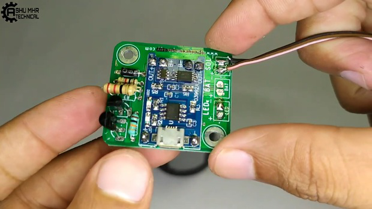{width="7.477777777777778in"
height="4.208333333333333in"}

DIY Solar Lamp: Page 24

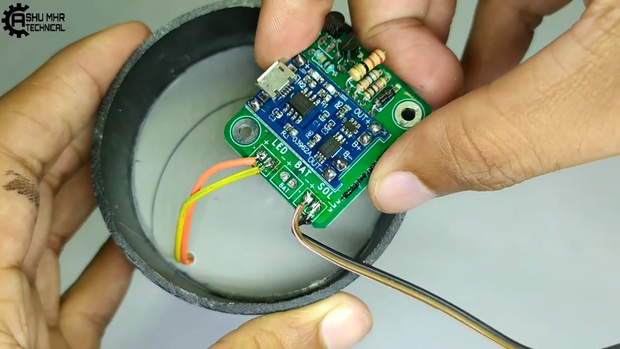{width="7.477777777777778in"
height="4.208333333333333in"}

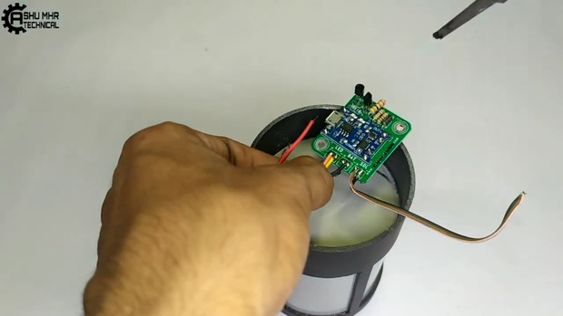{width="7.477777777777778in"
height="4.208333333333333in"}

DIY Solar Lamp: Page 25

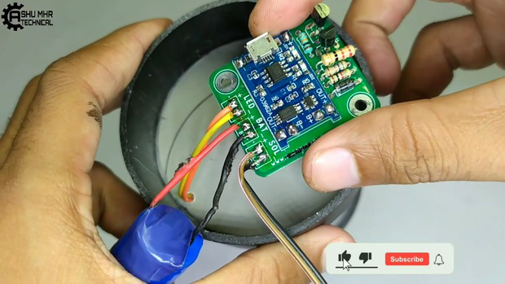{width="7.477777777777778in"
height="4.208333333333333in"}

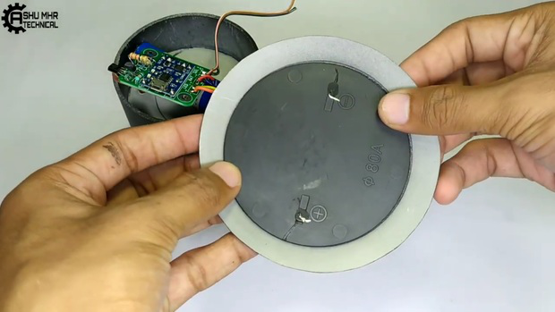{width="7.477777777777778in"
height="4.208333333333333in"}

DIY Solar Lamp: Page 26

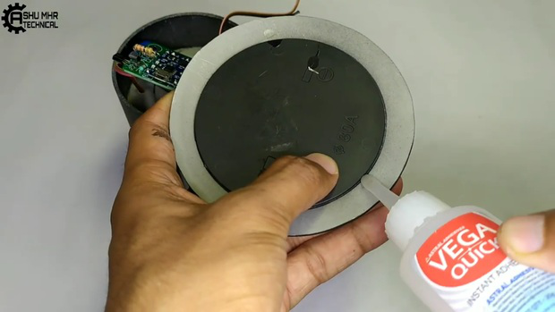{width="7.477777777777778in"
height="4.208333333333333in"}

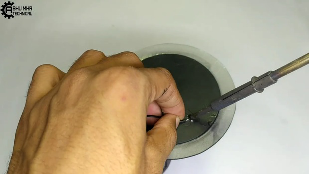{width="7.477777777777778in"
height="4.208333333333333in"}

DIY Solar Lamp: Page 27

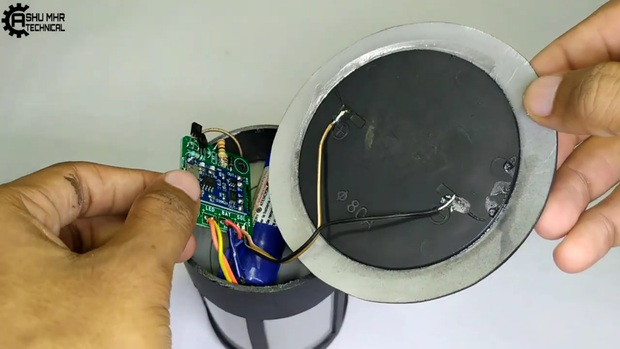{width="7.477777777777778in"
height="4.208333333333333in"}

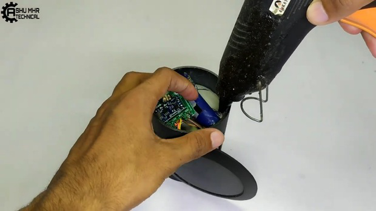{width="7.477777777777778in"
height="4.208333333333333in"}

DIY Solar Lamp: Page 28

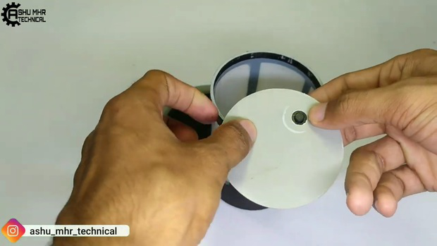{width="7.477777777777778in"
height="4.208333333333333in"}

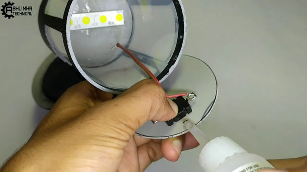{width="7.477777777777778in"
height="4.208333333333333in"}

DIY Solar Lamp: Page 29

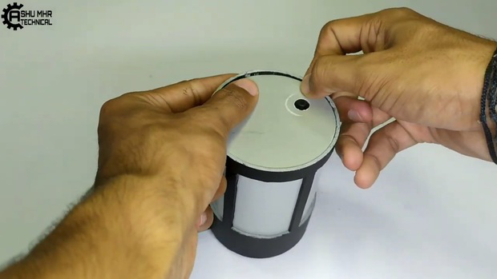{width="7.477777777777778in"
height="4.208333333333333in"}

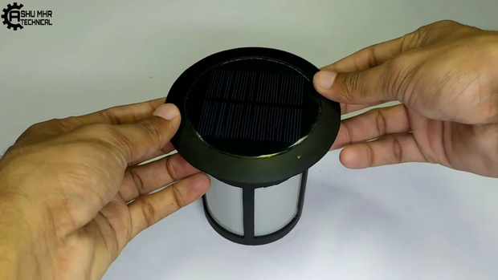{width="7.477777777777778in"
height="4.208333333333333in"}

DIY Solar Lamp: Page 30

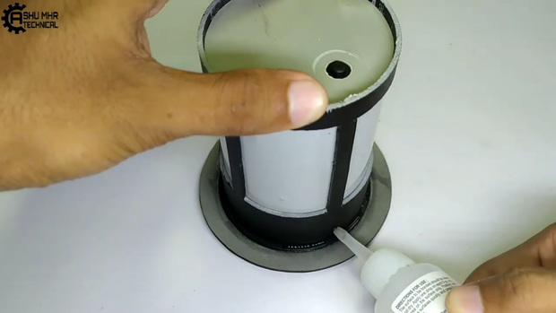{width="7.477777777777778in"
height="4.208333333333333in"}

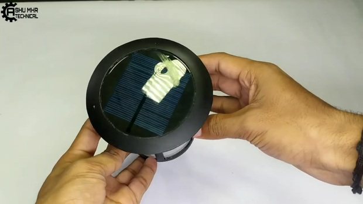{width="7.477777777777778in"
height="4.208333333333333in"}

DIY Solar Lamp: Page 31

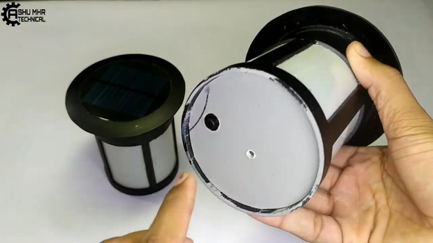{width="7.477777777777778in"
height="4.208333333333333in"}

> **Step 6: Testing**
>
> Finally testing the DIY Smart Solar Lamp.
>
> It will automatically charged in Daylight with the help of solar panel
> and turns on the lamp automatically during night.
>
> **[New users will also get some coupons while registering atvia this
> blue link.]{.ul}**
>
> [**Thank you for reading this guide, hopefully**, **this guide
> provides full steps to help you to create your own this guide provides
> full steps to help you to create your own**]{.ul}**DIY**
>
> **Solar Lamp[..If you have any questions please post them in the
> comment section below]{.ul}. [If you have any questions please post
> them in the comment section below]{.ul}.**

DIY Solar Lamp: Page 32

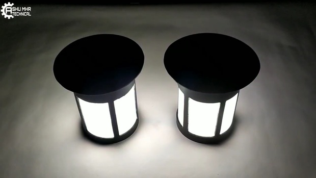{width="7.477777777777778in"
height="4.208333333333333in"}

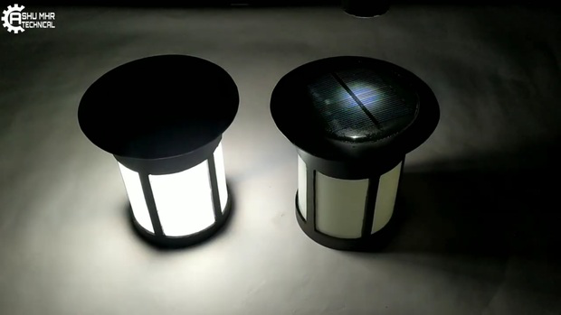{width="7.477777777777778in"
height="4.208333333333333in"}

DIY Solar Lamp: Page 33

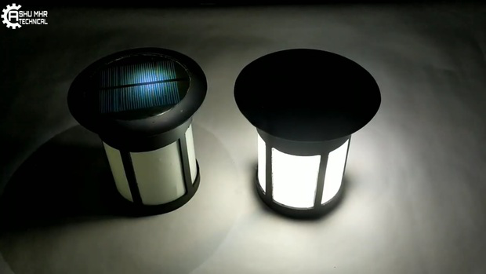{width="7.477777777777778in"
height="4.208333333333333in"}

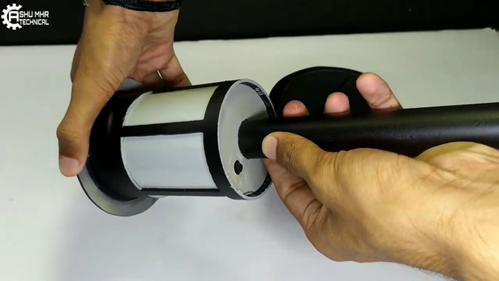{width="7.477777777777778in"
height="4.208333333333333in"}

DIY Solar Lamp: Page 34

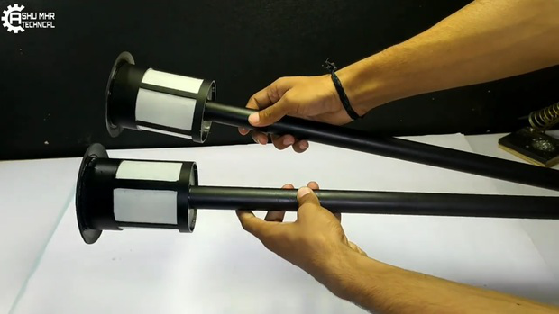{width="7.477777777777778in"
height="4.208333333333333in"}

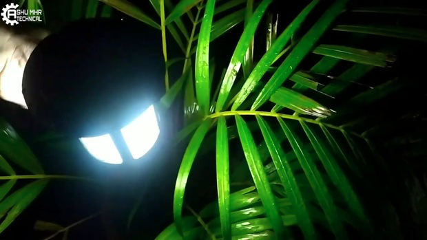{width="7.477777777777778in"
height="4.208333333333333in"}

DIY Solar Lamp: Page 35

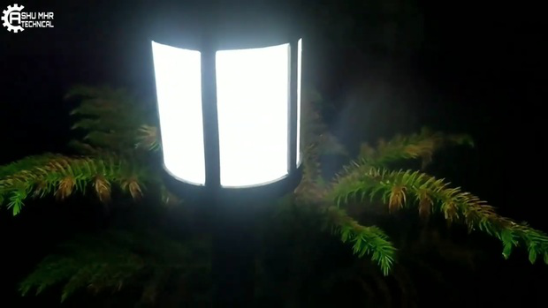{width="7.477777777777778in"
height="4.208333333333333in"}

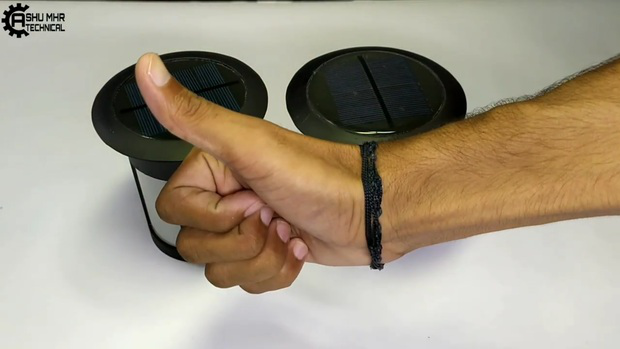{width="7.477777777777778in"
height="4.208333333333333in"}

DIY Solar Lamp: Page 36
